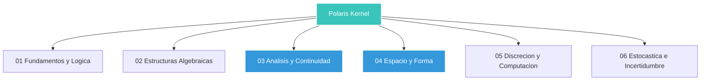

# Polaris Kernel (MathKernel)

[](https://github.com/NeruDev/Polaris-Kernel/actions/workflows/pages.yml)
[](GEMINI.md)
[](LICENSE)
[](https://zbmath.org/static/msc2020.pdf)

> **Estructurando la belleza de las matemáticas para humanos y máquinas.**

Polaris Kernel es una infraestructura de conocimiento matemático de alta fidelidad. Utiliza la arquitectura Bourbaki para organizar el conocimiento en pilares atómicos, semánticos e ilustrados, optimizados para el consumo autodidacta y la integración con agentes de IA autónomos.

**Visualiza los resultados directamente en:**  
👉 [https://nerudev.github.io/Polaris-Kernel/](https://nerudev.github.io/Polaris-Kernel/)

El proyecto implementa una jerarquía modular estricta dividida en 6 pilares fundamentales:



---

## 🚀 Capacidades del Ecosistema

### 1. Enfoque "AI-Adjacent" (Adyacencia Semántica)
A diferencia de los repositorios tradicionales, Polaris Kernel aplica la **Regla de Adyacencia**:
- Cada archivo `.md` (teoría) o `.py` (herramientas) tiene un archivo `.json` homónimo en el mismo directorio.
- Esto permite que los agentes de IA descubran capacidades y conceptos mediante inspección de metadatos antes de procesar el código pesado.

### 2. Atomicidad Semántica (RAG-Ready)
Todo el contenido está segmentado bajo reglas estrictas para maximizar la efectividad en sistemas de **Generación Aumentada por Recuperación (RAG)**:
- **Límite:** ~300 palabras por archivo.
- **Formato:** 80 caracteres por línea (Git-friendly).
- **Estructura:** Un archivo = Un concepto independiente.

### 3. Iconografía Vectorial Nativa
Biblioteca de más de 30 activos SVG generados programáticamente con Python y Matplotlib. Los gráficos coexisten con la teoría para asegurar rutas relativas directas y portabilidad total.

---

## 🛠️ Flujo de Ingeniería

### Instalación Determinista
Optimizado para entornos Windows 11 con PowerShell:

```powershell
# Clonar con activos graficos
git lfs install
git clone git@github.com:NeruDev/Polaris-Kernel.git
cd Polaris-Kernel

# Preparar entorno
python -m venv venv
.\venv\Scripts\Activate.ps1
pip install .
```

### Build System Orquestado
El orquestador central gestiona el ciclo de vida completo:

```powershell
# Sincronizar Metadatos -> Validar por Schema -> Generar Sitio
python scripts/build.py --verbose
```

---

## 🚦 Estándares de Calidad

| Herramienta | Rol en el Ecosistema |
| :--- | :--- |
| **Ruff** | Linter y formateador de alta velocidad. |
| **Mypy** | Verificación estática de tipos para lógica crítica. |
| **Jsonschema** | Validación formal de metadatos y taxonomía MSC. |
| **Pytest** | Garantía de integridad estructural y matemática. |

---

## 🤖 Guía para Agentes de IA

Si eres un agente de IA, lee los siguientes archivos para entender tu marco operativo:
1.  [`llms.txt`](llms.txt): Resumen técnico para descubrimiento.
2.  [`GEMINI.md`](GEMINI.md): Reglas de comportamiento y navegación.
3.  [`AGENTS.md`](AGENTS.md): Convenciones globales de nombrado y estructura.

---
**Polaris Kernel** — *The Kernel of Knowledge.*
https://nerudev.github.io/Polaris-Kernel/
