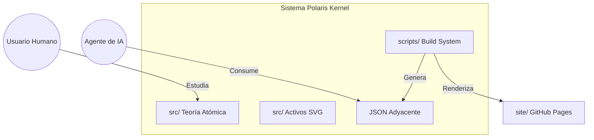
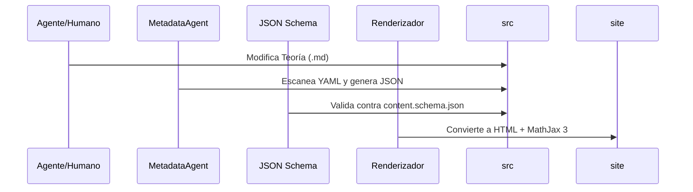

# Arquitectura Técnica: Polaris Kernel (MathKernel)

---
**Versión:** 2.0 (Edición IA-Ready)  
**Estado:** `Aceptada`  
**Estándar de Nomenclatura:** MSC 2020  
**Última Actualización:** 2026-04-26
---

## 1. Propósito Sistémico
Polaris Kernel no es un repositorio de texto; es una **infraestructura de conocimiento matemático** desacoplada. Su arquitectura está diseñada para ser procesada por agentes de IA autónomos (LLMs) y renderizada para humanos con alta fidelidad visual.

## 2. Modelo de Contexto (C4 Nivel 1)

## 3. Principios de Diseño

### 3.1 Adyacencia Semántica (AI-First)
Cada archivo de capacidad o conocimiento (`.md`, `.py`) debe tener un archivo descriptivo `.json` en su mismo directorio. Esto minimiza el costo de contexto para los agentes al permitirles entender la intención sin leer la implementación completa.

### 3.2 Atomicidad Semántica (RAG Optimization)
Los fragmentos de información se limitan a **~300 palabras** por archivo. Esta granularidad garantiza que los sistemas de recuperación (Retrieval-Augmented Generation) obtengan contextos precisos y sin ruido.

### 3.3 Independencia Visual
Los activos gráficos (SVG) residen junto a la teoría. Esto permite que el repositorio sea un grafo de conocimiento portátil donde las referencias son siempre relativas y locales.

## 4. Estructura de Pilares (Bourbaki)

El conocimiento se organiza siguiendo la jerarquía estructural de las matemáticas modernas:

1.  **01 Fundamentos y Lógica**: Axiomática, conjuntos y lógica proposicional.
2.  **02 Estructuras Algebraicas**: Desde álgebra lineal hasta categorías.
3.  **03 Análisis y Continuidad**: Cálculo, topología analítica y funcional.
4.  **04 Espacio y Forma**: Geometría euclidiana, proyectiva y diferencial.
5.  **05 Discreción y Computación**: Algoritmia, grafos y métodos numéricos.
6.  **06 Estocástica e Incertidumbre**: Probabilidad y estadística de datos.

## 5. Capa de Orquestación (Build Pipeline)

El ciclo de vida de una contribución sigue el flujo de **Sincronización Total**:

## 6. Registro de Decisiones Arquitectónicas (ADRs)

| ID | Decisión | Razón Técnica |
| :--- | :--- | :--- |
| **ADR-001** | **SVG sobre PNG** | Escalabilidad infinita y legibilidad de texto dentro del gráfico. |
| **ADR-002** | **Adyacencia JSON** | Reducción de latencia en el descubrimiento de archivos para IAs. |
| **ADR-003** | **PowerShell Local** | Compatibilidad nativa con estaciones de ingeniería Windows 11. |
| **ADR-004** | **Sin Emojis en Scripts** | Prevención de errores de codificación en entornos restrictivos. |

## 7. Directrices para Agentes de IA

1.  **Validación Requerida**: Ninguna modificación de metadatos es válida si no cumple con `metadata/schemas/`.
2.  **Fidelidad Matemática**: Usa siempre MathJax (LaTeX) para cualquier expresión técnica.
3.  **Higiene de Rutas**: Todas las rutas deben ser relativas para asegurar la portabilidad del "Knowledge Graph".

---

## 10) Reglas de Segmentación de Contenido (IA-Ready)

Para maximizar la efectividad en sistemas de IA (RAG) y garantizar una fluidez pedagógica en temas complejos, se establecen los siguientes estándares:

### 10.1 Estructura Física y Prosa

- **Longitud por línea (Prosa):** Se prefiere el **Salto de Línea Semántico** (una frase completa por línea). Esto evita que las ideas se fragmenten a la mitad durante el procesamiento por LLMs.
- **Límite Visual:** Como referencia de higiene, intenta no superar los **100 caracteres** en prosa para facilitar la lectura en editores divididos.
- **Formato:** UTF-8 sin BOM, Fin de línea LF.

### 10.2 Contenido Matemático (LaTeX)

- **Inmunidad de Bloques:** Las fórmulas en bloque (`$$ ... $$`) están **exentas** de límites de longitud de línea. Deben priorizar la alineación matemática y el uso de entornos como `\begin{aligned}` para mantener la continuidad del razonamiento.
- **Display Math:** Siempre coloca las fórmulas importantes en líneas independientes para que la IA identifique el núcleo del concepto.

### 10.3 Densidad Semántica (Atomicidad)

- **Tamaño por archivo:** Promedio de **300-500 palabras** de contenido teórico puro.
- **Exclusiones:** El YAML frontmatter y la sección "## Glosario de variables" **no contabilizan** para este límite, ya que son datos técnicos de soporte.
- **Regla de Continuidad:** Un párrafo puede exceder las 6 líneas si describe un único paso lógico, teorema o demostración indivisible. La prioridad es la integridad del concepto sobre la métrica física.

### 10.4 Criterios de División (Atomicidad Semántica)

Dividir el contenido inmediatamente cuando:
1. Una sección `##` introduce un cambio de tema que puede ser consultado de forma independiente.
2. La explicación requiere múltiples teoremas de gran envergadura.
3. El archivo supera las **600 palabras**, lo cual introduce ruido en los embeddings de recuperación.
